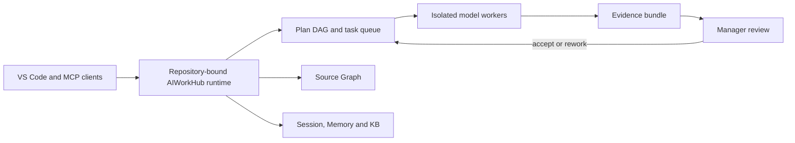

# AIWorkHub

<div align="center">
  
</div>

<p align="center">
  <strong>The local-first control plane for multi-model software development.</strong><br>
  Plan work, delegate it to coding models, preserve project context and accept
  changes only when the evidence passes.
</p>

<p align="center">
  <a href="https://github.com/shrec/AIWorkHub/actions/workflows/ci.yml"></a>
  <a href="https://github.com/shrec/AIWorkHub/releases"></a>
  <a href="LICENSE"></a>
  
  
</p>

AIWorkHub turns each Git repository into an isolated AI engineering workspace.
It connects the models already available in VS Code to a repository-scoped task
queue, Source Graph, Session Manager, AI Memory, knowledge base and review
inbox. No AIWorkHub cloud account or HTTP service is required.

## Why AIWorkHub

- **Spend less context.** Agents query a structural Source Graph and durable
  project context instead of repeatedly scanning the same source tree.
- **Delegate safely.** Dependency-aware tasks run in bounded workspaces with
  explicit write scopes, timeouts and cancellation.
- **Review evidence, not claims.** Diffs, tests, tool-use receipts, artifacts
  and approval history travel with every task.
- **Keep repositories isolated.** Every repository owns its `.aiworkhub/`
  state, callbacks, indexes, memories and audit trail.
- **Use multiple models.** Route work by capability, readiness, cost and
  observed quality without moving project authority into a hosted service.

## How it works



The MCP server uses stdio only. Writes and process launches are independently
disabled by default. Credentials stay outside the repository, callback events
are durable and repository state remains local.

<div align="center">
  
  <br>
  <em>AIWorkHub orchestrating its own development with repository-scoped context, tasks and review callbacks.</em>
</div>

## Install the VS Code extension

Download the VSIX from the latest
[GitHub release](https://github.com/shrec/AIWorkHub/releases), then run:

```bash
code --install-extension aiworkhub-*.vsix
```

In VS Code:

1. Open a Git repository.
2. Run **AIWorkHub: Open Dashboard**.
3. Choose **Initialize AIWorkHub** once.
4. Open a new model chat so it discovers the repository MCP tools.

Initialization is explicit and idempotent. It creates `.aiworkhub/`, starts the
first Source Graph index and keeps the index fresh. The packaged extension runs
on Linux, macOS, native Windows, WSL and the workspace host in Remote-SSH.

Marketplace, Open VSX and PyPI publication paths are release-automated; see
[Publishing](docs/PUBLISHING.md) for registry-owner setup and current channels.

## Headless development install

```bash
git clone https://github.com/shrec/AIWorkHub.git
cd AIWorkHub
python3 -m venv .venv
. .venv/bin/activate
pip install -e .
AIWORKHUB_REPO_ROOT=/path/to/repository python -m aiworkhub.server
```

An MCP client can start the same runtime with:

```json
{
  "mcpServers": {
    "aiworkhub": {
      "command": "python3",
      "args": ["-m", "aiworkhub.server"],
      "env": {
        "AIWORKHUB_REPO_ROOT": "/path/to/repository",
        "AIWORKHUB_ALLOW_WRITES": "0",
        "AIWORKHUB_ALLOW_LAUNCH": "0"
      }
    }
  }
}
```

Enable writes and launches only in a trusted manager process. Launched workers
never inherit the manager launch capability.

## Product surface

| Area | Current capability |
| --- | --- |
| Tasks | Dependency DAG, collision checks, isolated workers, truthful terminal states and manager review |
| Source Graph | Automatic incremental indexing, bounded structural queries and continuous-use telemetry |
| Context | Repository-scoped Session Manager, AI Memory and KB read/write MCP tools |
| Quality | Deterministic verification, combined-tree validation and configurable evidence gates |
| Operations | Review Inbox, callbacks, live output, logs, storage retention and workforce scoring |
| Platforms | Linux, Windows, macOS and Remote-SSH release qualification |

The canonical combined review surface is `aiworkhub_completion_inbox`. Tool
availability and write authority are reported by the live MCP runtime; clients
should discover the schema rather than copy a frozen tool list from docs.

## Security model

- stdio transport; no AIWorkHub HTTP listener;
- separate `AIWORKHUB_ALLOW_WRITES` and `AIWORKHUB_ALLOW_LAUNCH` gates, both
  off by default;
- shell-free exact-task process launch and bounded workspaces;
- owner-only credentials outside repositories and secret-redacted logs;
- append-only audit evidence and authenticated tool-use receipts;
- fail-closed repository, manager, task and claim-episode identity checks.

Read [SECURITY.md](SECURITY.md) before enabling autonomous launches. Callback
delivery and its optional Codex compatibility transport are documented in
[Callback delivery](docs/CALLBACKS.md).

## Development

```bash
python -m pip install -e ".[dev]"
ruff check src/aiworkhub scripts tests
mypy
python -m pytest -q
npm --prefix vscode-extension install
npm --prefix vscode-extension test
```

Start with [Getting Started](docs/GETTING_STARTED.md), then use the
[Architecture](docs/ARCHITECTURE.md), [Product Roadmap](docs/PRODUCT_ROADMAP.md),
[Publishing Guide](docs/PUBLISHING.md), [Brand Guide](docs/BRAND.md) and
[Contributing Guide](CONTRIBUTING.md).

## Acknowledgements

Thanks to [null0xxx](https://github.com/null0xxx) for sharing
[kimi-atlas](https://github.com/null0xxx/kimi-atlas) and its thoughtful ideas
around multi-agent orchestration, deterministic quality gates and
evidence-driven verification. Those ideas helped inform parts of AIWorkHub's
design exploration. AIWorkHub's repository Context Graph is an original
AIWorkHub concept; AIWorkHub remains an independent project with no official
affiliation or endorsement implied.

AIWorkHub is open source under the [MIT License](LICENSE).
