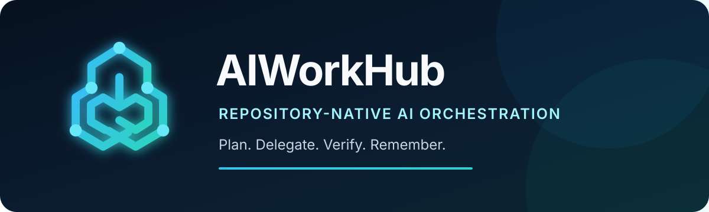
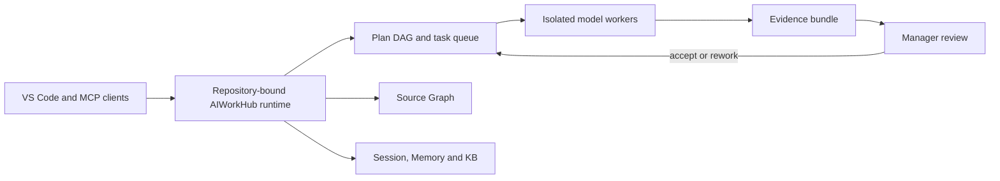
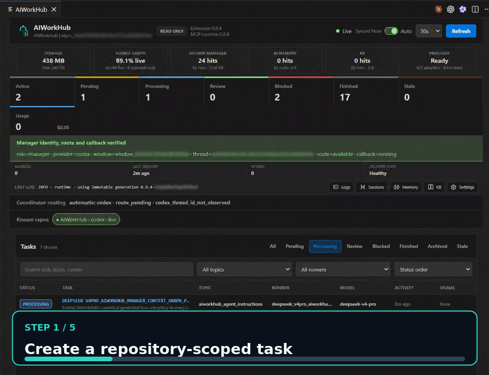
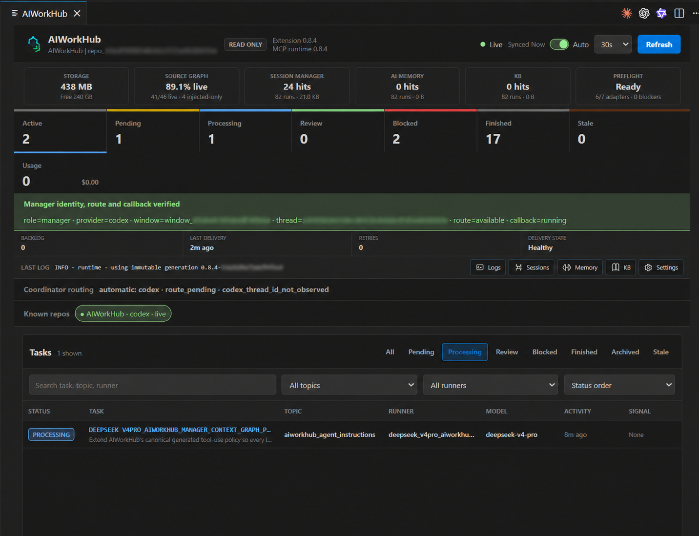

# AIWorkHub

<div align="center">
  
</div>

<p align="center">
  <strong>The local-first control plane for multi-model software development.</strong><br>
  Plan work, delegate it to coding models, preserve project context and accept
  changes only when the evidence passes.
</p>

<p align="center">
  <a href="https://github.com/shrec/AIWorkHub/actions/workflows/ci.yml"></a>
  <a href="https://github.com/shrec/AIWorkHub/releases"></a>
  <a href="LICENSE"></a>
  
  
</p>

AIWorkHub turns each Git repository into an isolated AI engineering workspace.
It connects the models already available in VS Code to a repository-scoped task
queue, Source Graph, Session Manager, AI Memory, knowledge base and review
inbox. No AIWorkHub cloud account or HTTP service is required.

## Supported models

AIWorkHub routes by runner family and adapter. Editor routes use models already
visible in VS Code; CLI routes reuse that CLI's own authenticated session.
AIWorkHub does not copy editor or CLI credentials.

| Runner family | Supported route | Install requirement | Credential |
| --- | --- | --- | --- |
| `codex_*` | `codex_cli` or VS Code LM | Codex CLI/extension, or a VS Code LM provider | Existing Codex login, or one-time VS Code model consent |
| `claude_*` | `claude_cli` or VS Code LM | Claude Code CLI/extension, or a VS Code LM provider | Existing Claude subscription login, or one-time VS Code model consent |
| `deepseek_*` | DeepSeek V4 Pro/Flash through VS Code LM; Copilot CLI BYOK fallback | DeepSeek-capable VS Code provider; fallback requires GitHub Copilot CLI | VS Code model consent; fallback uses `aiworkhub-deepseek-credential set` |
| `glm_*` | GLM 5.2 through VS Code LM; Copilot CLI BYOK fallback | GLM 5.2 visible in VS Code; fallback requires GitHub Copilot CLI | VS Code model consent; fallback uses `python -m aiworkhub.glm_credentials setup` |
| `copilot_*` | Public VS Code Language Model API | GitHub Copilot extension | GitHub sign-in and one-time model consent |

Exact model availability is discovered at runtime because subscriptions and
editor model catalogs differ. The editor broker starts automatically, performs
credential-free discovery, and asks for consent only when an exact queued task
first invokes that model. In Remote-SSH, the workspace extension uses VS
Code's Language Model API to consume the same model catalog exposed by the
Windows/macOS/Linux client window; it does not look for a second provider
credential on the SSH host. The dashboard reports visible **editor models**
separately from execution **routes**, so a redundant unavailable CLI fallback
is never presented as a missing model or repository blocker.

## Why AIWorkHub

- **Spend less context.** Agents query a structural Source Graph and durable
  project context instead of repeatedly scanning the same source tree.
- **Delegate safely.** Dependency-aware tasks run in bounded workspaces with
  explicit write scopes, timeouts and cancellation.
- **Review evidence, not claims.** Diffs, tests, tool-use receipts, artifacts
  and approval history travel with every task.
- **Keep repositories isolated.** Every repository owns its `.aiworkhub/`
  state, callbacks, indexes, memories and audit trail.
- **Use multiple models.** Route work by capability, readiness, cost and
  observed quality without moving project authority into a hosted service.

## Source intelligence and durable context

AIWorkHub has two graphs with different authority. They are complementary,
not alternate names for the same feature.

| Surface | What it represents | Who uses it |
| --- | --- | --- |
| **Source Graph** | An automatically refreshed structural index with 34 configurable code/data/documentation families and 31 bounded query modes, used to return repository context instead of repeatedly scanning the tree | Managers and workers |
| **Manager Context Graph** | An opt-in, append-only ledger and deterministic graph of manager conversation evidence across repository, thread, session and task identities | Verified managers only |

The Manager Context Graph can search an earlier decision, recover the exact
bounded transcript range around it and follow deterministic relations to its
thread, session or task. It does not replace Session Manager (current state and
handoffs), AI Memory (durable lessons), KB (curated project knowledge), or the
Source Graph (code intelligence). Current passive capture supports completed
Codex user/assistant messages; reasoning, streaming deltas, tool output,
commands and approvals are excluded. Claude and Copilot capture adapters are
not yet claimed as shipped.

AIWorkHub reports context evidence rather than making an unverifiable savings
claim: requested/delivered bytes, acknowledged tool receipts, truncation and
degraded reasons remain distinguishable. See the
[Source Graph guide](docs/SOURCE_GRAPH.md),
[Manager Context Graph](docs/CONTEXT_GRAPH.md) and
[Source Graph economics](docs/PRODUCT_ROADMAP.md#p1--source-graph-economics-and-enforcement-080)
contract.

## How it works



The MCP server uses stdio only. Writes and process launches are independently
disabled by default. Credentials stay outside the repository, callback events
are durable and repository state remains local.

<div align="center">
  
  <br>
  <em>A 20-second view of the repository-scoped task, worker, evidence and review loop.</em>
</div>

<div align="center">
  
  <br>
  <em>AIWorkHub orchestrating its own development with repository-scoped context, tasks and review callbacks.</em>
</div>

## Install the VS Code extension

Install from the
[VS Code Marketplace](https://marketplace.visualstudio.com/items?itemName=IvaneChkheidze.aiworkhub)
or download the VSIX from the latest
[GitHub release](https://github.com/shrec/AIWorkHub/releases). For a downloaded
VSIX, run:

```bash
code --install-extension aiworkhub-*.vsix
```

In VS Code:

1. Open a Git repository.
2. Run **AIWorkHub: Open Dashboard**.
3. Choose **Initialize AIWorkHub** once.
4. Open a new model chat so it discovers the repository MCP tools.

Initialization is explicit and idempotent. It creates `.aiworkhub/`, starts the
first Source Graph index and keeps the index fresh. The packaged extension runs
on Linux, macOS, native Windows, WSL and the workspace host in Remote-SSH.

### Start a manager chat

Open a new Codex, Claude or other MCP-capable chat **after** initializing (or
upgrading) AIWorkHub. The new chat performs tool discovery and receives the
MCP Manager Contract banner. Start with this copy/paste prompt:

```text
Use AIWorkHub as the manager for the currently bound repository.
First call aiworkhub_manager_bootstrap, then verify repository identity,
manager route, callback health, Source Graph readiness and model preflight.
Recover relevant Session Manager state and make one bounded AI Memory query.
Do not edit files, create tasks or launch workers yet. Report what is ready,
what is degraded, and which repository you are authorized to manage.
```

The response should identify the same repository shown in the dashboard and
report `role=manager` with a verified route. If it reports an unverified role,
the wrong repository, no tools, or a stale runtime version, stop and use
**AIWorkHub: Restart MCP Connection** or open a fresh chat. Do not ask the
model to bypass the route or write directly to `.aiworkhub` databases.

Now describe the outcome in ordinary language. A useful second prompt is:

```text
Plan this outcome with AIWorkHub: <describe the change and constraints>.
Inspect the repository with Source Graph, create bounded dependency-aware
task cards with exact acceptance criteria, allowed writes and validation,
then launch every independent non-colliding ready task in parallel on the
best available models. Keep dependent or overlapping work pending. When a
callback arrives, independently review evidence and accept or reject it.
Give me a short progress report after each accepted wave.
```

You do not need to name a model. Preflight and Workforce expose the models
already authorized in the editor, and the manager chooses a route from live
readiness and observed outcomes. Name a model only when you intentionally want
to override automatic routing.

### Understand the task lifecycle

| State/action | Meaning | Owner |
| --- | --- | --- |
| `task_create → pending` | A durable card exists; no model is running yet | Manager |
| claim + launch → `processing` | The exact dependency-ready card was claimed and its worker process started | AIWorkHub runtime |
| `review_ready` | Worker stopped and submitted diff/tests/logs/artifacts/tool receipts | Worker |
| callback | Wakes the repository's current verified manager; it is not approval | AIWorkHub callback bridge |
| accept or reject | Promote verified work, or preserve evidence and issue exact residual work | Manager |

Never move a card to `processing` merely because it is pending, and never
infer completion from chat prose. The canonical task receipt is state truth.
All review and terminal categories are callback-eligible. If a connection
drops after a write, reconcile the same task ID; identical retries are
idempotent, while inventing a replacement ID creates duplicate work.

### First task workflow

1. Confirm **Preflight** is ready and lists at least one editor model or
   authenticated CLI route. Optional/redundant unavailable routes do not block
   the repository.
2. Ask the manager chat for a bounded task. The canonical card records the
   objective, acceptance criteria, dependencies, write scope and validation.
3. Launch the exact card. The worker uses repository-local Source Graph and
   durable context inside an isolated task workspace.
4. Follow **Live Output** or wait for the durable terminal callback.
5. In **Review**, inspect the diff, tests, logs, artifacts and tool receipts.
   Accept to promote the verified change, or reject with exact residual work.

For ongoing work, ask the manager: `Inspect the completion inbox, finalize all
review-ready tasks from verified evidence, rebase the task DAG, and launch the
next dependency-safe parallel wave.` Workers never finalize their own work.

The dashboard's **Operations** dialog explains real tool use, Source Graph
modes, model outcomes, latency, token/cost evidence, callback delivery and
storage retention. See the [complete user guide](docs/GETTING_STARTED.md) for
multi-repository, Remote-SSH and troubleshooting flows.

**Current public channels:** VS Code Marketplace and signed-by-checksum GitHub
Release artifacts (VSIX, wheel and source distribution). Marketplace review
can briefly lag a new GitHub tag; the release page and attached `SHA256SUMS`
remain the exact artifact authority. Open VSX and PyPI jobs remain opt-in; see
[Publishing](docs/PUBLISHING.md) for owner setup.

## Headless development install

```bash
git clone https://github.com/shrec/AIWorkHub.git
cd AIWorkHub
python3 -m venv .venv
. .venv/bin/activate
pip install -e .
AIWORKHUB_REPO_ROOT=/path/to/repository python -m aiworkhub.server
```

An MCP client can start the same runtime with:

```json
{
  "mcpServers": {
    "aiworkhub": {
      "command": "python3",
      "args": ["-m", "aiworkhub.server"],
      "env": {
        "AIWORKHUB_REPO_ROOT": "/path/to/repository",
        "AIWORKHUB_ALLOW_WRITES": "0",
        "AIWORKHUB_ALLOW_LAUNCH": "0"
      }
    }
  }
}
```

Enable writes and launches only in a trusted manager process. Launched workers
never inherit the manager launch capability.

## Product surface

| Area | Current capability |
| --- | --- |
| Tasks | Dependency DAG, collision checks, isolated workers, truthful terminal states and manager review |
| Source Graph | 34 configurable code/data/documentation families, 31 bounded structural and analytical modes, automatic incremental indexing and continuous-use telemetry |
| Context | Repository-scoped Session Manager, AI Memory and KB read/write MCP tools |
| Quality | Deterministic verification, combined-tree validation, diff-scoped multi-language Known Bug Scanner and configurable evidence gates |
| Operations | KPI charts, Review Inbox, callbacks, live output, authenticated all-tool telemetry, bounded logs, reversible task/archive retention and workforce scoring |
| Platforms | Linux, Windows, macOS and Remote-SSH release qualification |

The KPI view separates explicit manager decisions from worker terminal
outcomes and plots only bounded repository evidence. Its larger aggregate-only
history shows Source Graph modes, workflow stages, latency, inter-call gaps,
returned structural evidence, index generations, tool-use cohorts and
deterministic raw-path-versus-delivered-bundle byte economics. Every rate
carries its sample window or denominator; token savings and causal quality
gains are deliberately not inferred. Inter-call gaps at or above the bounded
15-minute informational threshold are surfaced, but never mislabeled as proof
that a model was inactive.

The canonical combined review surface is `aiworkhub_completion_inbox`. Tool
availability and write authority are reported by the live MCP runtime; clients
should discover the schema rather than copy a frozen tool list from docs.

### Archive and storage lifecycle

AIWorkHub does not require repositories to keep task history forever. The
Storage view can preview archived tasks older than 30, 90, 180 or 365 days,
move an exact digest-bound batch into repository-local quarantine, restore it
during a seven-day undo window, and separately purge expired quarantine
payloads. Tasks with undelivered callbacks are protected, active/review tasks
cannot enter this cleanup path, and a compact audit record survives payload
purge. Individual completed tasks can also be archived or restored from the
task detail view.

Retention defaults are repository-local and configurable in Settings. Preview
never mutates data; quarantine and permanent purge require separate explicit
confirmation.

## Security model

- stdio transport; no AIWorkHub HTTP listener;
- separate `AIWORKHUB_ALLOW_WRITES` and `AIWORKHUB_ALLOW_LAUNCH` gates, both
  off by default;
- shell-free exact-task process launch and bounded workspaces;
- owner-only credentials outside repositories and secret-redacted logs;
- append-only audit evidence and authenticated tool-use receipts;
- fail-closed repository, manager, task and claim-episode identity checks.

Read [SECURITY.md](SECURITY.md) before enabling autonomous launches. Callback
delivery and its optional Codex compatibility transport are documented in
[Callback delivery](docs/CALLBACKS.md).

## Development

```bash
python -m pip install -e ".[dev]"
ruff check src/aiworkhub scripts tests
mypy
python -m pytest -q
npm --prefix vscode-extension install
npm --prefix vscode-extension test
```

Start with [Getting Started](docs/GETTING_STARTED.md), then use the
[Architecture](docs/ARCHITECTURE.md), [Product Roadmap](docs/PRODUCT_ROADMAP.md),
[Manager Context Graph](docs/CONTEXT_GRAPH.md),
[Publishing Guide](docs/PUBLISHING.md), [Brand Guide](docs/BRAND.md) and
[Contributing Guide](CONTRIBUTING.md).

## Acknowledgements

Thanks to [null0xxx](https://github.com/null0xxx) for sharing
[kimi-atlas](https://github.com/null0xxx/kimi-atlas) and useful ideas about
multi-agent orchestration and evidence-driven verification.

AIWorkHub is open source under the [MIT License](LICENSE).
