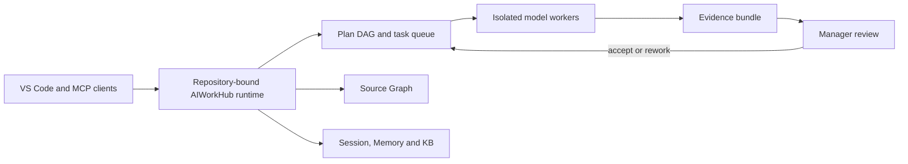

# AIWorkHub

<div align="center">
  
</div>

<p align="center">
  <strong>The local-first control plane for multi-model software development.</strong><br>
  Plan work, delegate it to coding models, preserve project context and accept
  changes only when the evidence passes.
</p>

<p align="center">
  <a href="https://github.com/shrec/AIWorkHub/actions/workflows/ci.yml"></a>
  <a href="https://github.com/shrec/AIWorkHub/releases"></a>
  <a href="LICENSE"></a>
  
  
</p>

AIWorkHub turns each Git repository into an isolated AI engineering workspace.
It connects the models already available in VS Code to a repository-scoped task
queue, Source Graph, Session Manager, AI Memory, knowledge base and review
inbox. No AIWorkHub cloud account or HTTP service is required.

## Supported models

AIWorkHub routes by runner family and adapter. Editor routes use models already
visible in VS Code; CLI routes reuse that CLI's own authenticated session.
AIWorkHub does not copy editor or CLI credentials.

| Runner family | Supported route | Install requirement | Credential |
| --- | --- | --- | --- |
| `codex_*` | `codex_cli` or VS Code LM | Codex CLI/extension, or a VS Code LM provider | Existing Codex login, or one-time VS Code model consent |
| `claude_*` | `claude_cli` or VS Code LM | Claude Code CLI/extension, or a VS Code LM provider | Existing Claude subscription login, or one-time VS Code model consent |
| `deepseek_*` | DeepSeek V4 Pro/Flash through VS Code LM; Copilot CLI BYOK fallback | DeepSeek-capable VS Code provider; fallback requires GitHub Copilot CLI | VS Code model consent; fallback uses `aiworkhub-deepseek-credential set` |
| `glm_*` | GLM 5.2 through VS Code LM; Copilot CLI BYOK fallback | GLM 5.2 visible in VS Code; fallback requires GitHub Copilot CLI | VS Code model consent; fallback uses `python -m aiworkhub.glm_credentials setup` |
| `copilot_*` | Public VS Code Language Model API | GitHub Copilot extension | GitHub sign-in and one-time model consent |

Exact model availability is discovered at runtime because subscriptions and
editor model catalogs differ. The dashboard preflight reports which adapters
are installed, authorized and launchable before a task is claimed.

## Why AIWorkHub

- **Spend less context.** Agents query a structural Source Graph and durable
  project context instead of repeatedly scanning the same source tree.
- **Delegate safely.** Dependency-aware tasks run in bounded workspaces with
  explicit write scopes, timeouts and cancellation.
- **Review evidence, not claims.** Diffs, tests, tool-use receipts, artifacts
  and approval history travel with every task.
- **Keep repositories isolated.** Every repository owns its `.aiworkhub/`
  state, callbacks, indexes, memories and audit trail.
- **Use multiple models.** Route work by capability, readiness, cost and
  observed quality without moving project authority into a hosted service.

## Source intelligence and durable context

AIWorkHub has two graphs with different authority. They are complementary,
not alternate names for the same feature.

| Surface | What it represents | Who uses it |
| --- | --- | --- |
| **Source Graph** | An automatically refreshed structural index with 33 configurable language/data families and 31 bounded query modes, used to return code context instead of repeatedly scanning the tree | Managers and workers |
| **Manager Context Graph** | An opt-in, append-only ledger and deterministic graph of manager conversation evidence across repository, thread, session and task identities | Verified managers only |

The Manager Context Graph can search an earlier decision, recover the exact
bounded transcript range around it and follow deterministic relations to its
thread, session or task. It does not replace Session Manager (current state and
handoffs), AI Memory (durable lessons), KB (curated project knowledge), or the
Source Graph (code intelligence). Current passive capture supports completed
Codex user/assistant messages; reasoning, streaming deltas, tool output,
commands and approvals are excluded. Claude and Copilot capture adapters are
not yet claimed as shipped.

AIWorkHub reports context evidence rather than making an unverifiable savings
claim: requested/delivered bytes, acknowledged tool receipts, truncation and
degraded reasons remain distinguishable. See the
[Source Graph guide](docs/SOURCE_GRAPH.md),
[Manager Context Graph](docs/CONTEXT_GRAPH.md) and
[Source Graph economics](docs/PRODUCT_ROADMAP.md#p1--source-graph-economics-and-enforcement-080)
contract.

## How it works



The MCP server uses stdio only. Writes and process launches are independently
disabled by default. Credentials stay outside the repository, callback events
are durable and repository state remains local.

<div align="center">
  
  <br>
  <em>A 20-second view of the repository-scoped task, worker, evidence and review loop.</em>
</div>

<div align="center">
  
  <br>
  <em>AIWorkHub orchestrating its own development with repository-scoped context, tasks and review callbacks.</em>
</div>

## Install the VS Code extension

Install from the
[VS Code Marketplace](https://marketplace.visualstudio.com/items?itemName=IvaneChkheidze.aiworkhub)
or download the VSIX from the latest
[GitHub release](https://github.com/shrec/AIWorkHub/releases). For a downloaded
VSIX, run:

```bash
code --install-extension aiworkhub-*.vsix
```

In VS Code:

1. Open a Git repository.
2. Run **AIWorkHub: Open Dashboard**.
3. Choose **Initialize AIWorkHub** once.
4. Open a new model chat so it discovers the repository MCP tools.

Initialization is explicit and idempotent. It creates `.aiworkhub/`, starts the
first Source Graph index and keeps the index fresh. The packaged extension runs
on Linux, macOS, native Windows, WSL and the workspace host in Remote-SSH.

**Current public channels:** VS Code Marketplace and signed-by-checksum GitHub
Release artifacts (VSIX, wheel and source distribution). Marketplace review
can briefly lag a new GitHub tag; the release page and attached `SHA256SUMS`
remain the exact artifact authority. Open VSX and PyPI jobs remain opt-in; see
[Publishing](docs/PUBLISHING.md) for owner setup.

## Headless development install

```bash
git clone https://github.com/shrec/AIWorkHub.git
cd AIWorkHub
python3 -m venv .venv
. .venv/bin/activate
pip install -e .
AIWORKHUB_REPO_ROOT=/path/to/repository python -m aiworkhub.server
```

An MCP client can start the same runtime with:

```json
{
  "mcpServers": {
    "aiworkhub": {
      "command": "python3",
      "args": ["-m", "aiworkhub.server"],
      "env": {
        "AIWORKHUB_REPO_ROOT": "/path/to/repository",
        "AIWORKHUB_ALLOW_WRITES": "0",
        "AIWORKHUB_ALLOW_LAUNCH": "0"
      }
    }
  }
}
```

Enable writes and launches only in a trusted manager process. Launched workers
never inherit the manager launch capability.

## Product surface

| Area | Current capability |
| --- | --- |
| Tasks | Dependency DAG, collision checks, isolated workers, truthful terminal states and manager review |
| Source Graph | 33 configurable language/data families, 31 bounded structural and analytical modes, automatic incremental indexing and continuous-use telemetry |
| Context | Repository-scoped Session Manager, AI Memory and KB read/write MCP tools |
| Quality | Deterministic verification, combined-tree validation, diff-scoped multi-language Known Bug Scanner and configurable evidence gates |
| Operations | Review Inbox, callbacks, live output, logs, storage retention and workforce scoring |
| Platforms | Linux, Windows, macOS and Remote-SSH release qualification |

The canonical combined review surface is `aiworkhub_completion_inbox`. Tool
availability and write authority are reported by the live MCP runtime; clients
should discover the schema rather than copy a frozen tool list from docs.

## Security model

- stdio transport; no AIWorkHub HTTP listener;
- separate `AIWORKHUB_ALLOW_WRITES` and `AIWORKHUB_ALLOW_LAUNCH` gates, both
  off by default;
- shell-free exact-task process launch and bounded workspaces;
- owner-only credentials outside repositories and secret-redacted logs;
- append-only audit evidence and authenticated tool-use receipts;
- fail-closed repository, manager, task and claim-episode identity checks.

Read [SECURITY.md](SECURITY.md) before enabling autonomous launches. Callback
delivery and its optional Codex compatibility transport are documented in
[Callback delivery](docs/CALLBACKS.md).

## Development

```bash
python -m pip install -e ".[dev]"
ruff check src/aiworkhub scripts tests
mypy
python -m pytest -q
npm --prefix vscode-extension install
npm --prefix vscode-extension test
```

Start with [Getting Started](docs/GETTING_STARTED.md), then use the
[Architecture](docs/ARCHITECTURE.md), [Product Roadmap](docs/PRODUCT_ROADMAP.md),
[Manager Context Graph](docs/CONTEXT_GRAPH.md),
[Publishing Guide](docs/PUBLISHING.md), [Brand Guide](docs/BRAND.md) and
[Contributing Guide](CONTRIBUTING.md).

## Acknowledgements

Thanks to [null0xxx](https://github.com/null0xxx) for sharing
[kimi-atlas](https://github.com/null0xxx/kimi-atlas) and useful ideas about
multi-agent orchestration and evidence-driven verification.

AIWorkHub is open source under the [MIT License](LICENSE).
