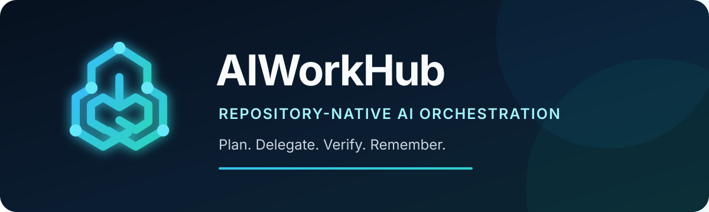
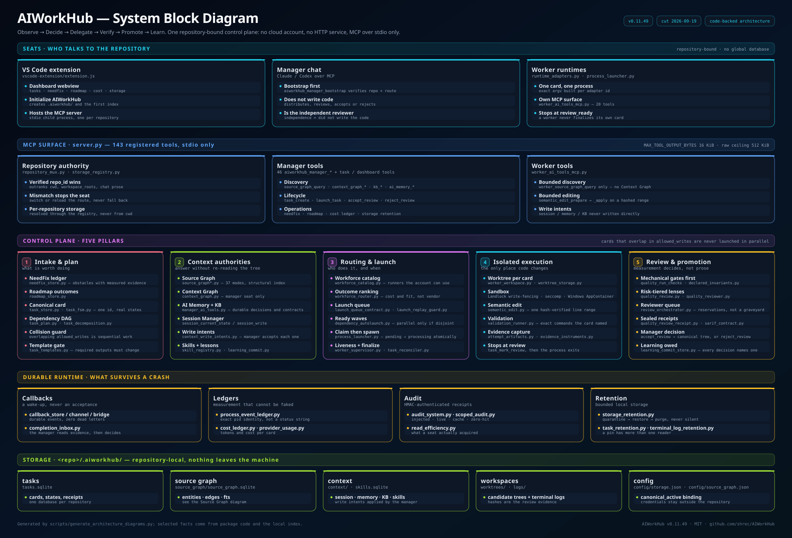
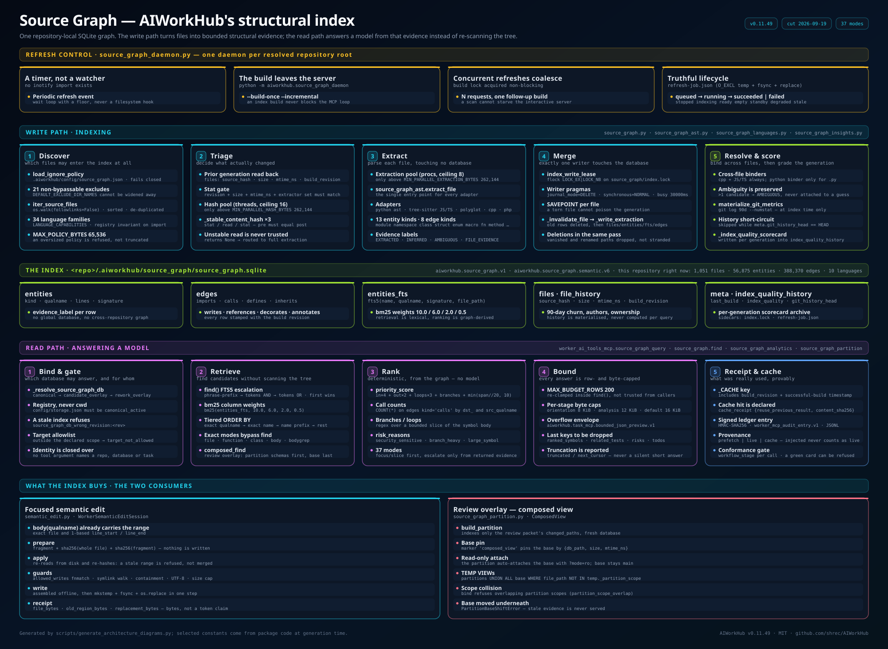
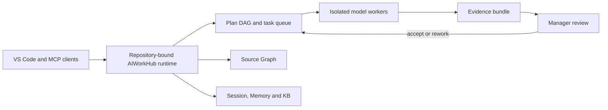
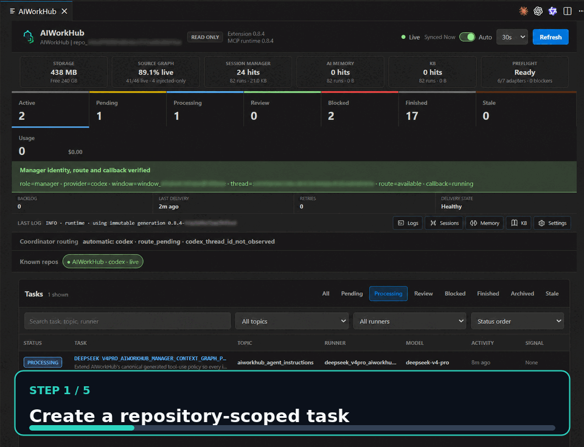
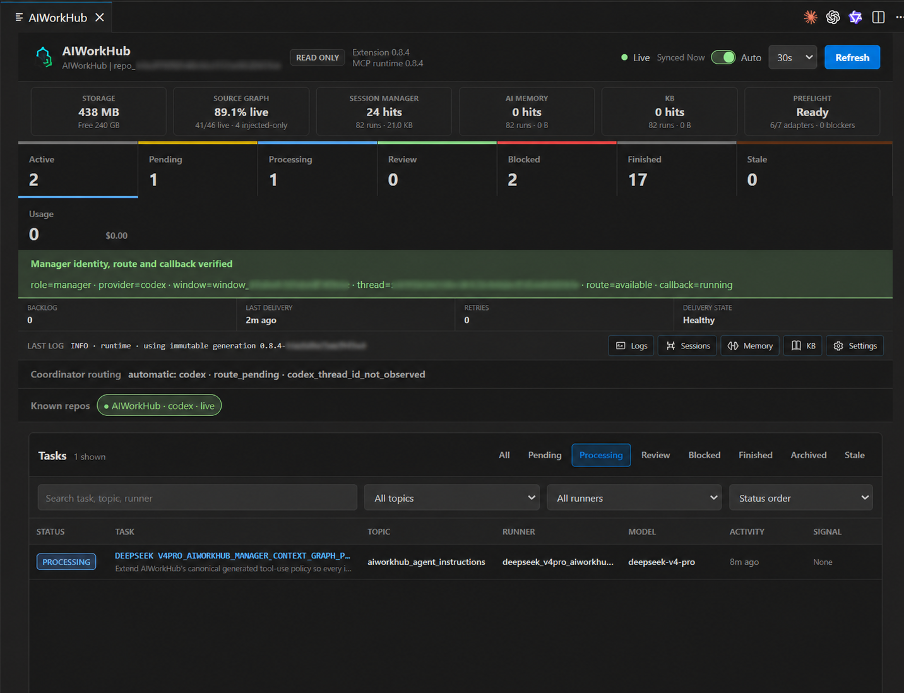

# AIWorkHub

<div align="center">
  
</div>

<p align="center">
  <strong>The open-source control plane for multi-model AI coding agents.</strong><br>
  Plan work, delegate it to coding models, preserve project context and accept
  changes only when the evidence passes.
</p>

<p align="center">
  <a href="https://github.com/shrec/AIWorkHub/actions/workflows/ci.yml"></a>
  <a href="https://shrec.github.io/AIWorkHub/"></a>
  <a href="https://github.com/shrec/AIWorkHub/releases"></a>
  <a href="LICENSE"></a>
  
  
</p>

AIWorkHub is an open-source, local-first multi-model AI coding agent
orchestrator for VS Code and MCP. It coordinates Codex, Claude, Copilot,
DeepSeek and GLM workers through dependency-aware task graphs, durable project
memory, source-code intelligence and evidence-based review. Each Git repository
remains an isolated AI engineering workspace; no AIWorkHub cloud account or
HTTP service is required. Visit the [AIWorkHub product site](https://shrec.github.io/AIWorkHub/)
or follow the [getting-started guide](docs/GETTING_STARTED.md).

## The whole system

<div align="center">
  <a href="site/assets/aiworkhub-system-architecture.png"></a>
</div>

AIWorkHub follows one durable loop: **Observe → Decide → Delegate → Verify →
Promote → Learn**. The map separates live foundations from the current
hardening wave and planned capabilities. Live foundations include NeedFix and
Roadmap intake, the Task DAG, Source Graph and durable context authorities,
outcome-aware workforce routing, isolated worktrees, semantic edits, validation,
sealed review receipts, provider-free replay and manager-controlled promotion.
The active closure wave covers reviewer MCP delivery, exact liveness, finalizer
leases, validation isolation, cross-platform parity, Source Graph refresh truth,
storage retention and NeedFix lifecycle reconciliation. Planned capabilities
include automatic NeedFix closure and TTL cleanup, provider controls, CPU-aware
parallelism, richer evidence visualization and quality-calibrated release
automation.

## Continuous Audit as a Service (CAAS)

**CAAS** stands for **Continuous Audit as a Service** — AIWorkHub audits its own
repositories continuously, as a service of the normal lifecycle rather than a
step someone remembers to run. The canonical protocol is
[docs/CAAS_PROTOCOL.md](docs/CAAS_PROTOCOL.md). `aiworkhub.caas_enforcement`
checks the protocol's automatically-enforceable properties on every guarded
lifecycle transition, so a repository cannot drift out of compliance silently;
`aiworkhub.audit_system` runs read-only, narrow-scope review passes that emit
structured findings into NeedFix with provenance.

> **Naming correction.** The expansion "Continuous Automated Assurance System"
> is wrong; the owner-canonical expansion is **Continuous Audit as a Service**.
> That incorrect wording lives in the separate **UltrafastSecp256k1** README and
> cannot be fixed from this repository — it must be corrected in that repository.

## What's new in 0.12.16

- Source Graph recovers an interrupted index without locking it: an open reader no longer makes recovery hang for half a minute with `database is locked`.
- A failed tool call from a VS Code language-model worker reports its real reason instead of "MCP unavailable".
- A language-model worker is stopped for malformed replies only when they come one after another.

## What's new in 0.12.15

- A card whose launch failed before the worker started can be retried on the same task instead of staying stuck.
- A worker's state and liveness stay visible while it reports a runtime notice.
- A validation replay that never ran a test is reported as a finalization failure, not as failed tests.
- Recovering a blocked rework keeps the rejected candidate and can still be routed to another worker.
- A failed promotion on Windows names the file, the operation and the cause, and a briefly locked file is retried.
- A worker is never started on an empty prompt.
- Groundwork for the admin-free Windows worker sandbox: repo-local slots and a restricted-token launch primitive. It is not active for workers yet.

## What's new in 0.12.14

- A review now shows how many tests passed, failed and were skipped, and the first failure, instead of only an exit code.
- Reworking a card whose files changed on main in the meantime launches again instead of stopping on a hash check.
- Stopping a worker on Windows ends its whole process tree and never reports a still-running process as stopped.
- Running the test suite no longer overwrites the built release package.
- A Codex manager that switched to another repository can switch back instead of stopping on a route ownership conflict.

## What's new in 0.12.13

- A manager can dismiss a low or medium reviewer finding with counter-evidence, on the record, instead of re-running the whole card.
- Two refusals now say why: a blocked recovery names the failing check, and a refused finding disposition names what is missing.
- A test command that ran zero tests no longer counts as passing evidence.
- Source Graph recovers from a damaged search index and keeps the real build error after a lost startup race.
- Workers on non-UTF-8 Windows locales read git output correctly, and fresh worktrees no longer show seeded files as modified.

## What's new in 0.12.12

- The NeedFix header shows the real open and stored counts instead of a constant 200.
- A launch that failed without changing anything can be recovered instead of blocking its card.

## What's new in 0.12.11

- A rejected review can demand new evidence: `validation_amendment` appends the required commands to the card's validation, so the next attempt must run them.

## What's new in 0.12.10

- Concurrent reviewer launches on Windows share one AppContainer profile instead of racing each other into a failed launch.
- Worker-sandbox test runs count as real coverage again: `tmp_path` tests run instead of skipping silently, and a reviewer that could not inspect is replaced rather than reused.
- Converted NeedFix rows are attributed to the card that introduced the defect, and Context MCP / KB writes no longer fail on read-only seats or legacy timestamp schemas.

## What's new in 0.12.9

- C/C++ code tasks launch with their project headers: angle-bracket includes resolve against the declared include roots.
- The Claude haiku route launches instead of failing with `model_not_found`.
- Rejecting a review stops its now-useless reviewers, and OpenCode workers lose the file-writing builtins they must not use.

## What's new in 0.12.8

- Rework and ranged `read_first` launches no longer fail on an emptied worktree or a `path:N-M` context suffix.
- Reviewer routing skips sandbox-dead adapters, and a running reviewer is never launched twice for one lens.
- Path scope checks fail closed on `.//`, leading-`/` and out-of-scope residual paths.

## What's new in 0.12.7

- SDLC stage proofs no longer stall: accepted cards that were archived later, and cards whose files moved on after accept, still reach build, test and deploy.
- Escaped-defect attribution counts only real, converted defects, so the quality metric is honest.

## What's new in 0.12.6

- Every card walks all six SDLC stages on its own, through deploy and maintain, each proven from receipts.
- Rework is safer: a reworked card keeps the previous attempt's changes on top of newer code, and a blocked rework can be recovered.
- Fewer stuck launches: a missing adapter is derived, stale reconciler locks hand over, and reviewer reuse matches the sealed attempt.

## What's new in 0.12.5

- The SDLC loop measures itself: quality drifts beyond 2σ/3σ file a NeedFix automatically, and escaped defects are traced to the card that introduced them.
- Every release leaves a receipt (commit, VSIX digest, rollback target, installed confirmation).
- Sandboxed workers can run their validation while they work, instead of finding failures only after they exit.

## What's new in 0.12.4

- Cleanup is automatic: after every task decision AIWorkHub removes the worktrees, logs, deltas and records nobody needs any more, and files a NeedFix if something cannot be removed.
- Worker effort follows the card's declared difficulty, so simple cards stop paying for maximum reasoning.
- Reviews are cheaper: one bounded read pass, and no duplicate reviewer for the same lens.

## What's new in 0.12.3

- Reworked cards are reviewed only on what changed since the last round, so a small fix no longer pays for a full review.
- Reviewers see the manager's rework instructions sealed into their own packet.

## What's new in 0.12.2

- AI Memory rebuilds a lost search index by itself, so worker cards stop failing on `fts_unavailable`.
- A forgotten Manager Console test session no longer claims to be the manager of every chat.
- Semantic edits land on the right lines in files with unusual line separators.
- Reviewers are no longer charged for supervisor faults, and directory diffs catch byte-only edits.

## What's new in 0.12.1

- Cards can be created and validated for every language Source Graph indexes, not only Python.
- Source Graph can compare two directory trees, down to changed hunks and changed symbols.
- Reviewer findings are no longer lost when they contain Unicode line separators.
- Each review lens runs one live reviewer, and findings point at indexed symbols.

## What's new in 0.12.0

- Sandboxed validation can create git repositories again, so launcher test suites run inside the sandbox.

## What's new in 0.11.99

- Fixes that land on main close their NeedFix automatically through a `Resolves:` commit trailer, so the NeedFix count follows the work.
- Card validation spends about 80 seconds less on the declared-invariants gate.
- Searching code for an exact quoted phrase finds it in the indexed source.

## What's new in 0.11.98

- Sandboxed Claude workers on Windows run shell commands through PowerShell, so they no longer stall on a shell that cannot start.
- Sandboxed validation parses code with a grammar copy kept inside the repository, with no C: drive access.

## What's new in 0.11.97

- A worker route that runs out of monthly credit is skipped automatically until it resets.
- Cards made from templates keep the repository's safety checks even when validation is overridden.

## What's new in 0.11.96

- Validation inside the Windows sandbox can run `git` again, so correct worker changes stop landing as validation failures.
- NeedFixes can be closed against a verified commit when their card was superseded.

## What's new in 0.11.95

- Rework relaunch and upgrade GC work again for workspaces created before the sandbox moved into the repository.
- Source Graph self-repairs a damaged full-text index; terminal failures keep their measured cause.

## What's new in 0.11.94

- Windows AppContainer worker sandboxes moved from `%TEMP%` into the repository; launches no longer touch C: permissions.

## What's new in 0.11.93

- Windows AppContainer workers no longer spend minutes to hours walking the user profile at launch and close.

## What's new in 0.11.92

- Manager route details follow the open Manager Chat session, not a missing Codex thread.

## What's new in 0.11.91

- Callbacks go to the Codex or Claude thread and to Manager Chat. Creating a callback task no longer requires a Codex thread when a manager session is active.

## What's new in 0.11.90

- Manager chat shows thinking and tool calls while the turn runs, and can set reasoning depth.

## What's new in 0.11.89

- Manager Chat can own callback tasks through its active session.

## What's new in 0.11.88

- OpenCode model toggles stay on. A stale settings refresh no longer snaps them back.

## What's new in 0.11.87

- The selected model binds to its own CLI. Opening Manager chat no longer restores an old transcript.

## What's new in 0.11.86

- Manager chat lists models. The chosen model binds the session to its CLI.

## What's new in 0.11.85

- Manager chat dropdowns no longer snap back to the session's last model.

## What's new in 0.11.84

- A manager session is not bound to a provider. The selected model attaches to that session.

## What's new in 0.11.83

- Manager chat no longer repeats the task board. Delete removes a session, and the list follows the selected backend.

## What's new in 0.11.82

- Manager chat restores the last session and binds its turns to Context Graph. The active session receives callbacks.

## What's new in 0.11.81

- Source Graph binds dotted Python imports and exact annotations. It does not guess os, ast, or Path.

## What's new in 0.11.80

- Source Graph binds exact JavaScript MCP tool calls to their Python handlers, and no longer binds member calls by name.

## What's new in 0.11.79

- Source Graph health names a Python/JavaScript boundary that has no cross-language call edges.

## What's new in 0.11.78

- Overlay bases are copy-pinned across volumes, and AppContainer launches use PowerShell instead of Git bash.

## What's new in 0.11.77

- The VS Code LM bridge accepts string line numbers when staging an edit, so a one-line pin is no longer rejected before the worker runs.

## What's new in 0.11.76

- Manager Chat is a persistent sidebar. Semantic edit accepts one-line ranges.
  Windows replay, AppContainer DACL, bodygrep resume, impact callers, and the
  nested LSP helper cwd limit are fixed in this build.

## What's new in 0.11.75

- VS Code LM workers fail closed after six Source Graph queries without an
  edit, so a varied discovery loop cannot burn the turn budget.

## What's new in 0.11.74

- VS Code LM workers stop repeated line-1 edit pins and invalid JSON before
  the agent turn limit, and worker semantic edit is no longer rewritten onto
  the manager editor.

## What's new in 0.11.73

- `node` and `node --test` validations run inside the Windows AppContainer:
  symlink-preserving resolution avoids the protected `C:\Users` ancestor, and
  in-process test isolation avoids libuv's denied named-pipe spin.

## What's new in 0.11.72

- Kilo/Grok workers now start with a safe request-local XDG state directory.
- AppContainer request grants stay below trusted user Temp and reject drive-root,
  profile, repository and reparse-point escapes.

## What's new in 0.11.71

- Repeated unchanged Source Graph calls are bounded before they can consume the
  full worker turn budget; real edits and material boundary changes reset the guard.

## What's new in 0.11.70

- Native OpenCode 2 workers keep Bun's temporary files inside the request-local
  AppContainer temp authority, preventing package-temp `lstat EPERM` failures.
- The canonical module-size invariant is restored without weakening its ratchet.

## What's new in 0.11.69

- Manager Chat automatically selects an allowed route on first send.
- LSP-backed Source Graph and focused delta review are wired into the runtime.
- Windows worker isolation now provisions Kilo's request-local XDG state path.
- Development Rules uses the honest label `applicable`, not `resolved`.

## What's new in 0.11.68

- C/C++ cards launch regardless of the include layout: a header AIWorkHub
  cannot place is left to the compiler instead of refusing the card.

## What's new in 0.11.67

- The Manager panel works on Codex: it starts with any model Codex offers and
  keeps the conversation across messages.

## What's new in 0.11.66

- Model lists follow the CLIs: Codex models come from Codex's own cache, and
  Claude aliases show the exact version they run.

## What's new in 0.11.65

- The Manager panel's Claude session holds the AIWorkHub manager tools, so it
  bootstraps and manages cards instead of stopping at a permission denial.

## What's new in 0.11.64

- The Manager panel's loop runs in its own write- and launch-enabled MCP child,
  started only when you press Start; the dashboard itself stays read-only.
- The Manager panel's model list fills itself from the enabled models.

## What's new in 0.11.63

- A Manager chat panel in the dashboard, on AIWorkHub's own manager agent
  loop: any of claude_cli, codex_cli or opencode_cli can hold the manager
  seat, task callbacks wake it by themselves, and sessions rotate through a
  handoff so the model can change without losing state.
- Manager tools return compact summaries by default, and the cost ledger
  finally sees Claude Code's own manager and subagent usage.

## What's new in 0.11.62

- Windows: a card sent back for rework runs again. The worker prompt reached
  the CLI on the command line, which Windows caps at 32767 characters, so every
  rework prompt was refused before the model ran; `claude_cli` and `codex_cli`
  now read it from stdin.

## What's new in 0.11.61

- The manager seat can launch on Windows: a host-side launch plan for the
  owner's own manager, while every worker's native CLI stays inside
  AppContainer.
- Windows AppContainer launch failures name their Win32 cause, the executable
  and the command-line and environment sizes — never an argument or
  environment value.
- The AppContainer validation lane skips the tests that need host privileges,
  with a named reason, instead of failing every card that runs them.
- Source Graph skips nested linked git worktrees, which had doubled results in a
  repository that holds another tool's worktree.

## What's new in 0.11.60

- The provider-neutral core of the AIWorkHub manager agent loop: one manager
  session per repository, a bounded rehydration brief built from the durable
  stores, one turn at a time, and rotation through a handoff — so the model
  that manages a repository can be switched without losing state. The server
  surface, callback wake-up and the dashboard chat panel follow.
- A validation-only replay grant is honoured from any verified manager route,
  not only `codex`.
- The shared development assets — roadmap, NeedFix backlog, tool recipes,
  skills, KB and AI memory — are tracked in git, so a clone carries the
  project's own history.

## What's new in 0.11.59

- Windows native `claude_cli` workers now run inside their AppContainer with
  their worker tools, measured on a real Windows 11 host.
  - The container is granted exactly the paths it needs.
  - Worker launches get outbound internet only. Validation launches get no
    network.
  - The worker MCP server runs on the host, behind a per-request pipe, and never
    trusts what the container can write.
- Windows AppContainer validation runs a card's declared commands. pytest and
  ruff run inside the container. `git diff --check` runs on the host, hardened,
  and refuses any link planted in the candidate worktree.
- Dashboard:
  - A compact, uniform header strip with status dots.
  - Only attention counters are coloured.
  - Readable light-theme contrast.
  - Task titles in rows.
- Semantic edits cannot be redirected through a junction planted in the
  worktree.
- C/C++ repositories: CMake-style `include/` headers resolve, and
  `cmake`/`ctest` are trusted validation tools.
- Blocked-card rework recovery works on Windows. Reviewer prewarm can no longer
  wedge the launch queue. Dispatcher health reports undelivered manager-inbox
  callbacks.
- VS Code LM workers get one correction for a tool name that is not allowlisted.
- Python for validation inside the container needs no setup for per-user,
  Program Files or Microsoft Store installs. Only an admin-owned directory
  outside Program Files, such as `C:\Python312`, needs a one-time elevated
  `icacls "<python dir>" /grant "*S-1-15-2-1:(OI)(CI)(RX)" /T`. The launch
  error names that exact command.

## What's new in 0.11.58

- The first four SDLC case stages are now gated on server-proven evidence
  (NF-2026-00945). Plan, Design, Build and Test can be recorded `ready` only
  when the server proves them from the repository's own canonical receipts (the
  bound task and its contract, the sealed candidate, the validation evidence and
  the coordinator's accepted outcome); a caller can no longer self-declare a
  verdict, and a `ready` receipt is re-proven on every read. Receipts recorded
  before this gate stay visible for audit but no longer count as proof.
- Deploy and Maintain remain explicit refusals that name each missing producer:
  the SDLC Deploy and Maintain gates do not yet consume canonical deploy target
  allowlist, release/install/rollback receipts and approval policy, or deployed
  release identity, outcome metrics and control-limit policy, so a case's
  six-stage cycle cannot report complete. `not_applicable` is refused until a
  canonical policy registry exists.
- The isolated launch now puts the OpenCode worker's request-local `awh` MCP
  config into the worker's own environment on the Linux (Landlock, bubblewrap)
  and Windows AppContainer paths, and refuses the launch before any process
  spawns when the config contract is not met (NF-2026-00919). This is launch
  wiring covered by unit and integration tests only: live OpenCode/Muse worker
  qualification and Windows runtime qualification remain unmeasured.
- LSP index integration, the OpenCode manager callback, the full stage-gated
  Playbook lifecycle and reasoning-quality measurement are not part of this
  release and remain pending; no reasoning-quality improvement is claimed.

## What's new in 0.11.57

- Reviewer and rework Source Graph overlays now pin the exact base index
  generation they were built against, so an ordinary canonical index
  publication no longer breaks an in-flight review, a newer generation never
  leaks into a sealed review, and a replaced or mutated pin fails closed
  (NF-2026-00946).
- A manager can reroute a retained candidate after a zero-delta launch failure
  (for example a provider authentication failure) that blocked-rework recovery
  already returned to pending. The reroute is authorized only by the canonical
  claim, launch-failure and recovery chain plus the process ledger, and only
  once (NF-2026-00778).
- LSP index integration, OpenCode/Muse worker qualification, the full
  stage-gated Playbook lifecycle and reasoning-quality measurement are not part
  of this release and remain pending.

## What's new in 0.11.56

- Explicit manager recovery of a blocked task can now recover a timed-out
  candidate whose worktree retention already collected, from the delta sealed
  when the attempt terminated. The sealed delta is accepted only when it
  authenticates against the exact repository, task, request, claim epoch and
  hash-pinned changed paths; anything else fails closed with a typed reason and
  leaves the task unchanged, and the clean-root escape refuses rather than
  discard the sealed bytes (NF-2026-00594).
- LSP index integration, the OpenCode manager callback, provider-neutral
  Playbook completion, Muse worker qualification and portable `.aiworkhub` data
  are not part of this release and remain pending.

## What's new in 0.11.55

- Roadmap views now carry a server-side current-wave projection that names the
  one active wave, checks a goal only when all of its exact tasks are finished,
  and returns a typed `UNKNOWN` reason when the evidence is ambiguous, truncated
  or malformed. The dashboard wave mini-roadmap renders that projection instead
  of ranking Roadmap rows itself and shows the installed version and the wave's
  target separately.
- Task creation, including from a template, accepts an optional exact
  `wave_goal_binding` that replaces a named predecessor as one wave goal's
  current task. It is applied once, repaired by the reconciler if interrupted,
  and never inferred from titles or prose.
- The reconciler completes a wave only when every acceptance criterion maps to
  a goal whose exact tasks are all canonically accepted with verifier receipts;
  pending or unresolved evidence leaves it open, and no version bump can close
  it.
- Worker validation sandboxes seed the tracked repository assets a declared test
  locates by a literal `Path(__file__)`-relative path (NF-2026-00551).
- Inferred successor progression, the full stage-gated Playbook, LSP index
  integration and Muse/OpenCode worker qualification remain incomplete.

## What's new in 0.11.54

- Source Graph's authenticated concurrent builder now appears as standby, not a
  false degraded preflight against a fresh canonical index (NF-2026-00933).
- Automatic mini-roadmap progression and the full Playbook/LSP work remain in
  progress; this is a task-system unblock, not a completion claim.

## What's new in 0.11.53

- Semantic-review prompts now request hash-matched candidate overlays for
  omitted hunks in truncated packets, while missing or stale evidence still
  fails closed (NF-2026-00931).
- Required-output checks, terminal-failure classification and bounded dashboard
  snapshots reduce avoidable task and operator churn.
- Worker-attempt reasoning/context receipts are durable, but provider-internal
  effort and quality impact are not yet proven.
- Full Playbook stage gates, LSP index integration and Muse/OpenCode worker
  qualification remain in progress.

## What's new in 0.11.52

- Semantic review is now bounded to a candidate's exact changed segments and
  fails closed on missing or stale changed-segment evidence.
- Source Graph adds a bounded LSP transport with fail-closed definition
  classification over a private workspace. LSP index integration is not
  included in this release.
- The dashboard wave mini-roadmap renders the current wave's goals as a live
  checklist joined to each goal's task states.
- Blocked-rework recovery lets a strictly later terminal failure supersede a
  stale retained predecessor (NF-2026-00515).
- The full stage-gated Playbook, reasoning matched to an accepted outcome, and
  Muse/OpenCode worker qualification remain incomplete.

## What's new in 0.11.51

- Repository-bound SDLC case receipts and exact task links are available through
  MCP. The full stage-gated Playbook remains in progress.
- VS Code LM records the reasoning option actually sent and the model-reported
  context capacity; provider-internal effort and outcome improvement remain
  unverified. Accepted-task metrics now distinguish complete, incomplete and
  unverified histories.
- OpenCode's MCP alias stays bounded to `awh`; several worker recovery and
  Source Graph call-coordinate fixes are included. Semantic Review's new delta
  scope and LSP index resolution are not yet part of this release.

## What's new in 0.11.50

- Verified reasoning and context wiring for CLI workers and the VS Code
  LM bridge: effort flags or modelOptions are applied only when the
  decision is APPLIED; context capacity is recorded and never used to
  pad prompts.
- The dashboard identity strip includes a wave mini-roadmap info popup
  for the current in-progress Roadmap wave.
- Native reviewer retained streams also compact thinking deltas so a
  long reasoning turn does not refuse a completed review.
- Repository-only: sparse worker validation seeds the VS Code test
  raster fixtures, and the unreadable OpenCode config check is
  sandbox-safe. Those are not VSIX-shipped features.

## What's new in 0.11.49

- This intermediate release combines the previously staged Windows and
  OpenCode fixes with repository-neutral OpenCode MCP registration (`awh`),
  outcome-linked NeedFix metrics and accepted-task evaluation evidence.
- SDLC metrics now read SQLite safely even when the repository path contains
  `#`; the accepted-task corpus is resealed against 49 current-byte examples.
- The 0.11.45-0.11.48 changelog entries describe changes included here; no
  separate Git tags were published for those numbers.

## What's new in 0.11.44

- Windows task creation, installed-tool measurement, authority-key validation and
  reconciler recovery now use platform-safe paths from the merged Windows fix
  stack.
- The global collision guard now ignores pending cards whose dependencies lack
  an authenticated accepted-outcome receipt, while processing and review scopes
  remain active.
- 0.11.44 was the previous source metadata version; Marketplace and GitHub
  Release publication are separate measured channels.

## What's new in 0.11.43

- The manager MCP surface now exposes the same hash-bound, range-scoped
  semantic-edit tools workers use, so the manager can make small, verified
  edits instead of a whole-file rewrite.
- A new read-only dashboard surface reports measured skill-selection
  coverage; an absent or unreadable skill store reports `measured: False`
  with a reason instead of a zero that reads as healthy and empty.
- A deterministic, read-only attempt-trajectory export composes a card's
  audit history, process lifecycle ledger, attempt artifacts and recorded
  usage into one canonical JSON document per request; every field is
  measured evidence or an explicit `UNKNOWN`.
- 0.11.43 is the current source release in this repository; Marketplace and
  GitHub Release publication of that exact version are separate channels this
  README does not assert without measured evidence.
## Supported models

AIWorkHub routes by runner family and adapter. Editor routes use models already
visible in VS Code; CLI routes reuse that CLI's own authenticated session.
AIWorkHub does not copy editor or CLI credentials.

| Runner family | Supported route | Install requirement | Credential |
| --- | --- | --- | --- |
| `codex_*` | `codex_cli` or VS Code LM | Codex CLI/extension, or a VS Code LM provider | Existing Codex login, or one-time VS Code model consent |
| `claude_*` | `claude_cli` or VS Code LM | Claude Code CLI/extension, or a VS Code LM provider | Existing Claude subscription login, or one-time VS Code model consent |
| `deepseek_*` | DeepSeek V4 Pro/Flash through VS Code LM; Copilot CLI BYOK fallback | DeepSeek-capable VS Code provider; fallback requires GitHub Copilot CLI | VS Code model consent; fallback uses `aiworkhub-deepseek-credential set` |
| `glm_*` | GLM 5.2 through VS Code LM; Copilot CLI BYOK fallback | GLM 5.2 visible in VS Code; fallback requires GitHub Copilot CLI | VS Code model consent; fallback uses `python -m aiworkhub.glm_credentials setup` |
| `copilot_*` | Public VS Code Language Model API | GitHub Copilot extension | GitHub sign-in and one-time model consent |

Exact model availability is discovered at runtime because subscriptions and
editor model catalogs differ. The editor broker starts automatically, performs
credential-free discovery, and asks for consent only when an exact queued task
first invokes that model. In Remote-SSH, the workspace extension uses VS
Code's Language Model API to consume the same model catalog exposed by the
Windows/macOS/Linux client window; it does not look for a second provider
credential on the SSH host. The dashboard reports visible **editor models**
separately from execution **routes**, so a redundant unavailable CLI fallback
is never presented as a missing model or repository blocker.

## Why AIWorkHub

- **Use models as a portfolio.** Keep frontier models for difficult judgment,
  route bounded throughput to lower-cost capable models, and use deterministic
  tools where no model is needed.
- **Reduce avoidable model work.** Agents query a structural Source Graph,
  read bounded regions and emit focused replacements instead of repeatedly
  scanning or regenerating whole files.
- **Delegate safely.** Dependency-aware tasks run in bounded workspaces with
  explicit write scopes, timeouts and cancellation.
- **Review evidence, not claims.** Diffs, tests, tool-use receipts, artifacts
  and approval history travel with every task.
- **Keep repositories isolated.** Every repository owns its `.aiworkhub/`
  state, callbacks, indexes, memories and audit trail.
- **Use multiple models.** Route work by capability, readiness, cost and
  observed quality without moving project authority into a hosted service.

Codex, Claude, Copilot, DeepSeek and GLM are not products AIWorkHub tries to
replace. They are execution routes in its workforce. AIWorkHub supplies the
repository-scoped planning, context, isolation, evidence, review and economics
layer that lets expensive and economical models work together as one system.

### Three layers of model economics

| Lever | What AIWorkHub changes | User benefit | Current evidence boundary |
| --- | --- | --- | --- |
| **Token efficiency** | Source Graph discovery, bounded reads, focused context and replacement-only semantic edits | Less avoidable input and code-generation output on eligible work | 31,998 file bytes versus 531 replacement bytes is a verified 60.26× code-output shape ratio; total provider-token multiplier remains unmeasured |
| **Model-mix efficiency** | Routes bounded throughput to lower-cost capable models and reserves premium models for hard judgment or review | The same useful workload can consume fewer expensive-model tokens even when total tokens are unchanged | In one 36-run Claude cohort, Opus was 19% of tokens but 42.9% of known cost; quality-adjusted cross-model savings are the next required measurement |
| **Attempt efficiency** | Separates launch, validation, timeout and review failures so residual work can be repaired instead of blindly repeated | Fewer expensive retries and clearer reasons for rework | 47 of 114 historical attempts were retries and used 88.31M tokens; this locates the opportunity but does not claim every retry was avoidable |

These levers compound: reducing a task's unnecessary tokens and then running
the remaining bounded work on a cheaper capable model can lower cost more than
either optimization alone. Every saving still has to preserve validation and
manager-accepted quality; a cheap failed run is not an economic success.

### Where AIWorkHub sits

| Layer | Examples | Relationship to AIWorkHub |
| --- | --- | --- |
| **Repository control plane** | AIWorkHub | Owns task truth, dependencies, routing, context authorities, isolation, evidence, callbacks, review and economics telemetry |
| **Supported execution workforce** | Codex, Claude, Copilot-hosted models, DeepSeek, GLM | Models and agent runtimes AIWorkHub coordinates; they are not competitors |
| **Adjacent context/edit tooling** | Graphify, Serena and similar graph or semantic toolkits | Complementary ideas/capabilities; they do not provide the same complete repository control loop |
| **Standalone coding-agent products** | Aider, Cline and similar clients | Alternative execution experiences, not the same product layer |
| **Actual alternative today** | Manual multi-chat coordination or custom in-house glue | The workflow AIWorkHub replaces: copy/paste context, hand-managed worktrees, retries and review state |

## Source intelligence and durable context

<div align="center">
  <a href="site/assets/aiworkhub-source-graph-architecture.svg"></a>
</div>

AIWorkHub has two graphs with different authority. They are complementary,
not alternate names for the same feature.

| Surface | What it represents | Who uses it |
| --- | --- | --- |
| **Source Graph** | An automatically refreshed structural index with 34 configurable code/data/documentation families and exactly 37 bounded query modes, including exact-target `file`, `function`, `class`, `body`, `bodygrep` and `deps` modes, used to return repository context instead of repeatedly scanning the tree | Managers and workers |
| **Manager Context Graph** | An opt-in, append-only ledger and deterministic graph of manager conversation evidence across repository, thread, session and task identities | Verified managers only |

The Manager Context Graph can search an earlier decision, recover the exact
bounded transcript range around it and follow deterministic relations to its
thread, session or task. It does not replace Session Manager (current state and
handoffs), AI Memory (durable lessons), KB (curated project knowledge), or the
Source Graph (code intelligence). Current passive capture supports completed
Codex user/assistant messages; reasoning, streaming deltas, tool output,
commands and approvals are excluded. Claude and Copilot capture adapters are
not yet claimed as shipped.

AIWorkHub reports context evidence rather than making an unverifiable savings
claim: requested/delivered bytes, acknowledged tool receipts, truncation and
degraded reasons remain distinguishable. See the
[Source Graph guide](docs/SOURCE_GRAPH.md),
[Manager Context Graph](docs/CONTEXT_GRAPH.md) and
[Source Graph economics](docs/PRODUCT_ROADMAP.md#p1--source-graph-economics-and-enforcement-080)
contract.

For existing-file changes, the worker can stay on a focused path end to end.
Source Graph `body` returns one bounded symbol with exact line evidence; the
model emits only replacement code; AIWorkHub's local Python applier verifies
the complete-file preimage, the prepared fragment, write scope and range before
changing the isolated worktree. Full-file output remains available only as a
legacy fallback or for genuinely new files. Receipts report file, fragment and
replacement bytes, but do not turn those byte counts into an invented token
savings multiplier.

## Measured benefits and limits

The checked-in benchmark ledgers are recomputed in CI. They include favorable,
negative and still-unmeasured results.

| Evidence | Current observation | Status |
| --- | --- | --- |
| Focused-edit paired pilot | Historical capped A/B observation: 27.5% fewer total tokens, 24.9% fewer output tokens and 21.5% less elapsed time across two pairs, but pair 1 used mismatched `20k`/`200k` token ceilings | Not eligible for a causal or product-savings claim; uncapped matched rerun required |
| Authenticated edit shape | 531 replacement bytes for 31,998 existing-file bytes (1.66%; 60.26× structural ratio), with zero old bytes re-emitted | Verified reduction in emitted code payload when a full-file baseline applies; not a 60.26× claim for the complete provider bill |
| Current Source Graph gate | 7/7 gated tasks used live graph evidence; 13 calls, 0 failures; p50 15.024 ms | Verified runtime snapshot |
| Tool-use cohorts | Review-ready rate was 7.2% with missing graph use, 26.7% with live single-stage use and 33.3% with continuous use | Observational association; not causality |
| Legacy context packaging | The 0.8.81 v1 envelope expanded a 156-task payload by 20.0%; v2 later reduced the same-evidence representative fixture from 849 to 600 bytes (29.329%) | Historical negative baseline; structural fix shipped, live fleet remeasurement pending |
| Callback durability | 271 events, zero dead letters and zero backlog | Verified runtime snapshot |

See [Benchmarks](docs/BENCHMARKS.md) for the full evidence matrix, denominators,
adjacent-tool capability boundaries, raw ledgers and the promotion gate required
before publishing any universal savings claim.

## How it works


```mermaid
flowchart LR
    A[VS Code and MCP clients] --> B[Repository-bound AIWorkHub runtime]
    B --> C[Plan DAG and task queue]
    B --> D[Source Graph]
    B --> E[Session, Memory and KB]
    C --> F[Isolated model workers]
    F --> G[Evidence bundle]
    G --> H[Manager review]
    H -->|accept or rework| C
```

The MCP server uses stdio only. Writes and process launches are independently
disabled by default. Credentials stay outside the repository, callback events
are durable and repository state remains local.

<div align="center">
  
  <br>
  <em>A 20-second view of the repository-scoped task, worker, evidence and review loop.</em>
</div>

<div align="center">
  
  <br>
  <em>AIWorkHub orchestrating its own development with repository-scoped context, tasks and review callbacks.</em>
</div>

## Install the VS Code extension

Install from the
[VS Code Marketplace](https://marketplace.visualstudio.com/items?itemName=IvaneChkheidze.aiworkhub)
or download the VSIX from the latest
[GitHub release](https://github.com/shrec/AIWorkHub/releases). For a downloaded
VSIX, run:

```bash
code --install-extension aiworkhub-*.vsix
```

In VS Code:

1. Open a Git repository.
2. Run **AIWorkHub: Open Dashboard**.
3. Choose **Initialize AIWorkHub** once.
4. Open a new model chat so it discovers the repository MCP tools.

Initialization is explicit and idempotent. It creates `.aiworkhub/`, starts the
first Source Graph index and keeps the index fresh. The packaged extension runs
on Linux, macOS, native Windows, WSL and the workspace host in Remote-SSH.

### Start a manager chat

Open a new Codex, Claude or other MCP-capable chat **after** initializing (or
upgrading) AIWorkHub. The new chat performs tool discovery and receives the
MCP Manager Contract banner. Claude Code also reads the repository-local
`.mcp.json` registration and AIWorkHub-managed `CLAUDE.md` block: direct
Claude chats must bootstrap as managers and use Source Graph before broad
built-in file discovery. They are not worker sessions.

The prompt below is a portable first-run diagnostic for clients that do not
automatically honor repository instructions; it is not required in a correctly
initialized new Claude Code chat:

```text
Use AIWorkHub as the manager for the currently bound repository.
First call aiworkhub_manager_bootstrap, then verify repository identity,
manager route, callback health, Source Graph readiness and model preflight.
Recover relevant Session Manager state and make one bounded AI Memory query.
Do not edit files, create tasks or launch workers yet. Report what is ready,
what is degraded, and which repository you are authorized to manage.
```

The response should identify the same repository shown in the dashboard and
report `role=manager` with a verified route. If it reports an unverified role,
the wrong repository, no tools, or a stale runtime version, stop and use
**AIWorkHub: Restart MCP Connection** or open a fresh chat. Do not ask the
model to bypass the route or write directly to `.aiworkhub` databases.

Now describe the outcome in ordinary language. A useful second prompt is:

```text
Plan this outcome with AIWorkHub: <describe the change and constraints>.
Inspect the repository with Source Graph, create bounded dependency-aware
task cards with exact acceptance criteria, allowed writes and validation,
then launch every independent non-colliding ready task in parallel on the
best available models. Keep dependent or overlapping work pending. When a
callback arrives, independently review evidence and accept or reject it.
Give me a short progress report after each accepted wave.
```

You do not need to name a model. Preflight and Workforce expose the models
already authorized in the editor, and the manager chooses a route from live
readiness and observed outcomes. Name a model only when you intentionally want
to override automatic routing.

### Understand the task lifecycle

| State/action | Meaning | Owner |
| --- | --- | --- |
| `task_create → pending` | A durable card exists; no model is running yet | Manager |
| claim + launch → `processing` | The exact dependency-ready card was claimed and its worker process started | AIWorkHub runtime |
| `review_ready` | Worker stopped and submitted diff/tests/logs/artifacts/tool receipts | Worker |
| callback | Wakes the repository's current verified manager; it is not approval | AIWorkHub callback bridge |
| accept or reject | Promote verified work, or preserve evidence and issue exact residual work | Manager |

Never move a card to `processing` merely because it is pending, and never
infer completion from chat prose. The canonical task receipt is state truth.
All review and terminal categories are callback-eligible. If a connection
drops after a write, reconcile the same task ID; identical retries are
idempotent, while inventing a replacement ID creates duplicate work.

### First task workflow

1. Confirm **Preflight** is ready and lists at least one editor model or
   authenticated CLI route. Optional/redundant unavailable routes do not block
   the repository.
2. Ask the manager chat for a bounded task. The canonical card records the
   objective, acceptance criteria, dependencies, write scope and validation.
3. Launch the exact card. The worker uses repository-local Source Graph and
   durable context inside an isolated task workspace.
4. Follow **Live Output** or wait for the durable terminal callback.
5. In **Review**, inspect the diff, tests, logs, artifacts and tool receipts.
   Accept to promote the verified change, or reject with exact residual work.

For ongoing work, ask the manager: `Inspect the completion inbox, finalize all
review-ready tasks from verified evidence, rebase the task DAG, and launch the
next dependency-safe parallel wave.` Workers never finalize their own work.

The dashboard's **Operations** dialog explains real tool use, Source Graph
modes, model outcomes, latency, token/cost evidence, callback delivery and
storage retention. See the [complete user guide](docs/GETTING_STARTED.md) for
multi-repository, Remote-SSH and troubleshooting flows.

**Current public channels:** VS Code Marketplace and signed-by-checksum GitHub
Release artifacts (VSIX, wheel and source distribution). Marketplace review
can briefly lag a new GitHub tag; the release page and attached `SHA256SUMS`
remain the exact artifact authority. Open VSX and PyPI jobs remain opt-in; see
[Publishing](docs/PUBLISHING.md) for owner setup.

## Headless development install

```bash
git clone https://github.com/shrec/AIWorkHub.git
cd AIWorkHub
python3 -m venv .venv
. .venv/bin/activate
pip install -e .
AIWORKHUB_REPO_ROOT=/path/to/repository python -m aiworkhub.server
```

An MCP client can start the same runtime with:

```json
{
  "mcpServers": {
    "aiworkhub": {
      "command": "python3",
      "args": ["-m", "aiworkhub.server"],
      "env": {
        "AIWORKHUB_REPO_ROOT": "/path/to/repository",
        "AIWORKHUB_ALLOW_WRITES": "0",
        "AIWORKHUB_ALLOW_LAUNCH": "0"
      }
    }
  }
}
```

Enable writes and launches only in a trusted manager process. Launched workers
never inherit the manager launch capability.

## Product surface

| Area | Current capability |
| --- | --- |
| Tasks | Dependency DAG, collision checks, isolated workers, truthful terminal states and manager review |
| Source Graph | 34 configurable code/data/documentation families, exactly 37 bounded structural and analytical modes including exact-target `file`, `function`, `class`, `body`, `bodygrep` and `deps`, automatic incremental indexing, staged replacement-only semantic edits with offline envelope assembly and continuous-use telemetry |
| Context | Repository-scoped Session Manager, AI Memory and KB read/write MCP tools |
| Quality | Deterministic verification, combined-tree validation, diff-scoped multi-language Known Bug Scanner, truth-preserving SARIF 2.1.0 export and configurable evidence gates |
| Operations | KPI charts, Review Inbox, callbacks, live output, authenticated all-tool telemetry, bounded logs, reversible task/archive retention and workforce scoring |
| Platforms | Linux, Windows, macOS and Remote-SSH release qualification |

The KPI view separates explicit manager decisions from worker terminal
outcomes and plots only bounded repository evidence. Its larger aggregate-only
history shows Source Graph modes, workflow stages, latency, inter-call gaps,
returned structural evidence, index generations, tool-use cohorts,
deterministic raw-path-versus-delivered-bundle byte economics, authenticated
receipt conformance, repeated-query discipline, compact-replay bytes and
imported runtime coverage. The repository also ships registry-driven
retrieval precision, eval-artifact truth, per-test suite profiling, risk
precision, no-net-growth and matched A/B instruments. Missing populations are
shown as `not_configured`, `inconclusive` or `unknown`; they never become zero
or a synthetic savings multiplier.
Focused semantic edits additionally report authenticated source-file, selected-region and
replacement byte totals, including how many whole-file bytes the model did not
re-emit. Text-only and native VS Code LM providers can submit these fragments
one at a time; the local bridge validates hashes and overlaps, retains no
workspace mutation during staging, and assembles the final response offline.
This is structural evidence, not a token multiplier. Every rate
carries its sample window or denominator; token savings and causal quality
gains are deliberately not inferred. Inter-call gaps at or above the bounded
15-minute informational threshold are surfaced, but never mislabeled as proof
that a model was inactive.

The canonical combined review surface is `aiworkhub_completion_inbox`. Tool
availability and write authority are reported by the live MCP runtime; clients
should discover the schema rather than copy a frozen tool list from docs.

### Archive and storage lifecycle

AIWorkHub does not require repositories to keep task history forever. The
Storage view can preview archived tasks older than 30, 90, 180 or 365 days,
move an exact digest-bound batch into repository-local quarantine, restore it
during a seven-day undo window, and separately purge expired quarantine
payloads. Tasks with undelivered callbacks are protected, active/review tasks
cannot enter this cleanup path, and a compact audit record survives payload
purge. Individual completed tasks can also be archived or restored from the
task detail view.

Retention defaults are repository-local and configurable in Settings. Preview
never mutates data; quarantine and permanent purge require separate explicit
confirmation.

## Security model

- stdio transport; no AIWorkHub HTTP listener;
- separate `AIWORKHUB_ALLOW_WRITES` and `AIWORKHUB_ALLOW_LAUNCH` gates, both
  off by default;
- shell-free exact-task process launch and bounded workspaces;
- owner-only credentials outside repositories and secret-redacted logs;
- append-only audit evidence and authenticated tool-use receipts;
- fail-closed repository, manager, task and claim-episode identity checks.

Read [SECURITY.md](SECURITY.md) before enabling autonomous launches. Callback
delivery and its optional Codex compatibility transport are documented in
[Callback delivery](docs/CALLBACKS.md).

## Development

```bash
python -m pip install -e ".[dev]"
ruff check src/aiworkhub scripts tests
mypy
python -m pytest -q
npm --prefix vscode-extension install
npm --prefix vscode-extension test
```

Start with [Getting Started](docs/GETTING_STARTED.md), then use the
[Architecture](docs/ARCHITECTURE.md), [Product Roadmap](docs/PRODUCT_ROADMAP.md),
[Manager Context Graph](docs/CONTEXT_GRAPH.md),
[Publishing Guide](docs/PUBLISHING.md), [Brand Guide](docs/BRAND.md) and
[Contributing Guide](CONTRIBUTING.md).

## Acknowledgements

Thanks to [null0xxx](https://github.com/null0xxx) for sharing
[kimi-atlas](https://github.com/null0xxx/kimi-atlas) and useful ideas about
multi-agent orchestration and evidence-driven verification.

AIWorkHub is open source under the [MIT License](LICENSE).
